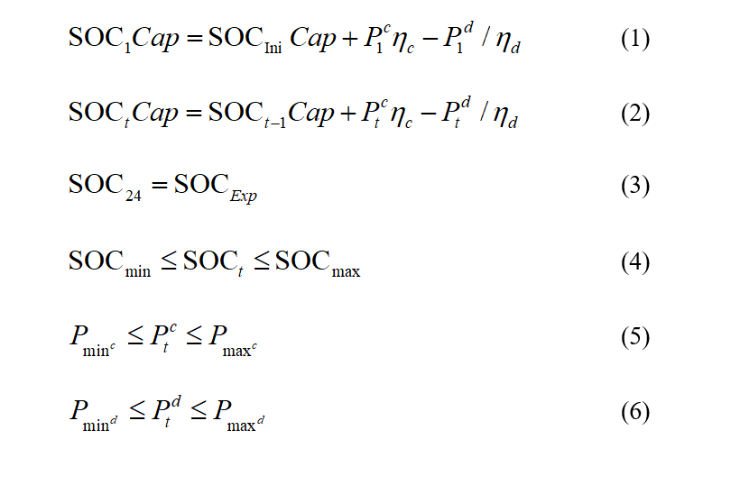
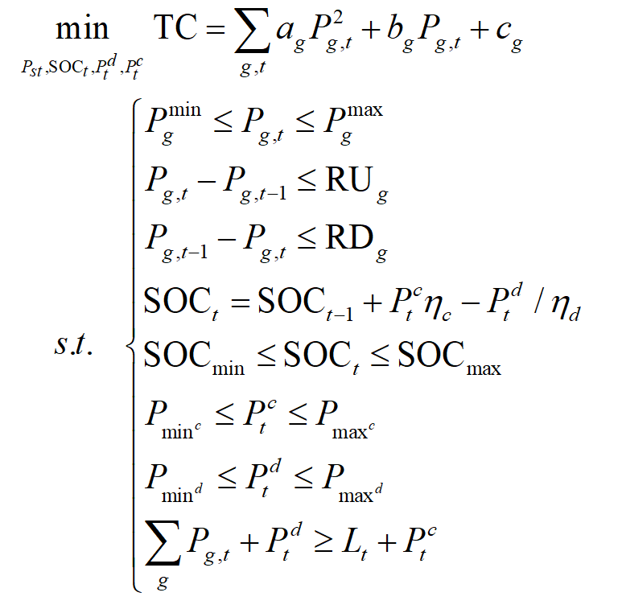

# Power-System-Optimization
一个电力系统的经济调度问题建模与求解

## Part 1：储能系统的约束介绍

&nbsp;  &nbsp; &nbsp; &nbsp;  其中，储能系统荷电状态(State of charge, SOC)的变化需满足功率平衡约束(1)-(3)，$\mathrm{SOC}_{Ini}$、$\mathrm{SOC}_{Exp}$分别表示储能系统的初值和终值（期望值），${{\eta }_{c}}$、${{\eta }_{d}}$为储能系统的充放电效率，表示储能系统的容量(MW)。为保证储能系统的有效运行，约束(4)-(6)规定了SOC以及充、放电功率的上下边界。

&nbsp;  &nbsp; &nbsp; &nbsp;  因此，带有储能系统的火电机组经济调度模型可以表示为：

其中，a、b、c表示发电机组的成本系数，Pg 表示每个发电机组的输出功率，且 Pg满足发电上、下限约束和爬坡约束。